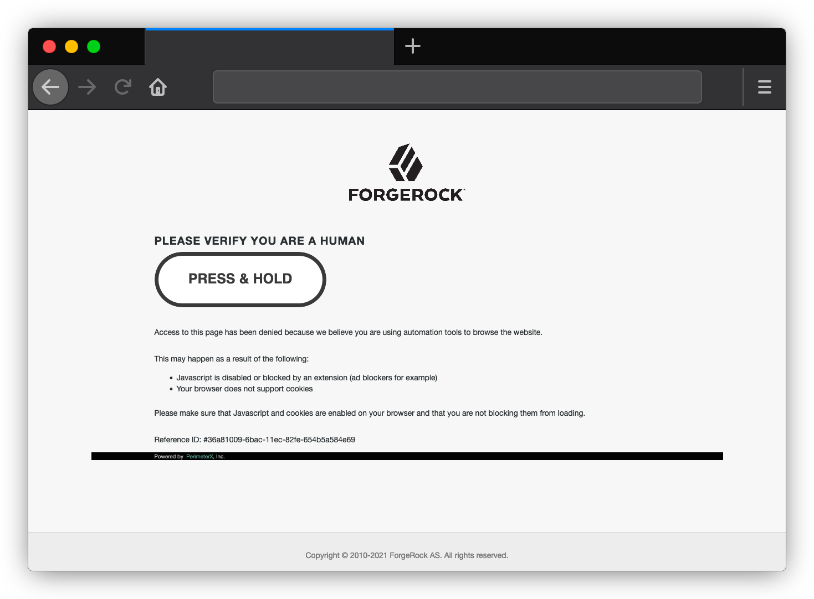

<!--
 * The contents of this file are subject to the terms of the Common Development and
 * Distribution License (the License). You may not use this file except in compliance with the
 * License.
 *
 * You can obtain a copy of the License at legal/CDDLv1.0.txt. See the License for the
 * specific language governing permission and limitations under the License.
 *
 * When distributing Covered Software, include this CDDL Header Notice in each file and include
 * the License file at legal/CDDLv1.0.txt. If applicable, add the following below the CDDL
 * Header, with the fields enclosed by brackets [] replaced by your own identifying
 * information: "Portions copyright [year] [name of copyright owner]".
 *
 * Copyright 2021 ForgeRock AS.
-->

# pxVerificationNode

PerimeterX Bot Defender nodes for [Identity Platform][forgerock_platform] 7.1.0 and above. Combined, the nodes handle the PerimeterX request verification process and the display of the challenge page.

## Installation

Copy the .jar files from the ../target directory into the ../web-container/webapps/openam/WEB-INF/lib directory where AM is deployed. Restart the web container to pick up the new node. The node will then appear in the authentication trees components palette.

## Usage

Drag the node to your journey and connect it after the Data Store Decision node. Connect the `true` output to your success node and the `false` output to the **pxChallengeNode** in order to show the challenge page for a blocked request. Finally, connect **pxChallengeNode** to the red X:

.

Make sure to fill in the required node properties for the **pxVerificationNode** node. You can find all the required data on the [PerimeterX Console](https://console.perimeterx.com).

When a request gets blocked, the default challenge page will be shown, as follows:

## Notes

The code in this repository has binary dependencies that live in the ForgeRock maven repository. Maven can be configured to authenticate to this repository by following the following [ForgeRock Knowledge Base Article](https://backstage.forgerock.com/knowledge/kb/article/a74096897).

ForgeRock does not warrant, guarantee or make any representations regarding the use, results of use, accuracy, timeliness or completeness of any data or information relating to the sample code. ForgeRock disclaims all warranties, expressed or implied, and in particular, disclaims all warranties of merchantability, and warranties related to the code, or any service or software related thereto.

ForgeRock shall not be liable for any direct, indirect or consequential damages or costs of any type arising out of any action taken by you or others related to the sample code.

[forgerock_platform]: https://www.forgerock.com/platform/
